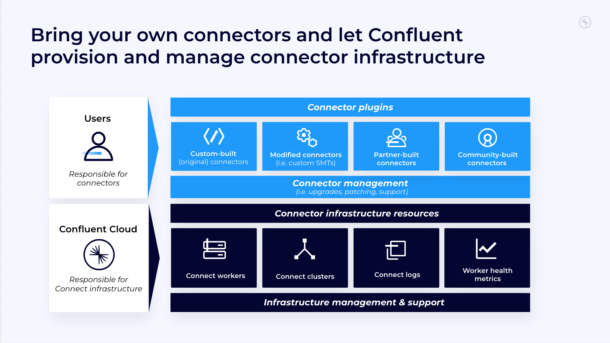

# Bring your own Custom Connectors to Confluent Cloud

<div align="center"> 
  
</div>

Connectors integrate Apache Kafka with external data systems, enabling you to move away from a brittle spaghetti architecture to one that is more streamlined, secure, and future-proof. Confluent offers a rich ecosystem of 120+ pre-built and certified connectors, including the largest portfolio of fully managed connectors in the industry with over 70 connectors and counting. However, every organization's data architecture is unique, making it challenging to rely solely on out-of-the-box connectors due to their specialized requirements. It is common for companies to have homegrown systems and/or custom applications used for their specific business model, which would require custom-built connectors to integrate them with Kafka. Even pre-built connectors in the Kafka ecosystem may need additional tweaks and modifications to work for your specific use case. Finally, there is the long tail of less popular data systems and niche applications for which there are no fully managed connector options and might not be for a while. For these reasons, companies must choose between leaving those data systems in silos or getting into the weeds of self-managing connectors for these exceptions. When self-managing connectors, your team takes on low-level Connect infrastructure activities like manually provisioning, patching, upgrading, and monitoring Connect clusters and workers, taking valuable time and resources away from building your streaming use cases.

If your team still spends multiple dev cycles building and managing connectors using just open-source Kafka Connect, it’s time to consider a faster and cost-effective alternative. On top of Confluent's 70 pre-built and fully managed connectors, we also have Custom Connectors for connecting to any data system with reduced operational burdens. You can bring your own connector plugins to Confluent Cloud and we’ll manage the underlying Connect infrastructure.

Custom connectors now provide the following functionalities::
- Offload the operational burdens of self-managing connectors with Confluent’s Custom Connectors when there isn’t a fully managed connector available
- Upload your connector plugin and provision Custom Connector instances
- Debug productively using connector and worker-level logs 
- Monitor health and performance metrics of your custom connectors

This demo will build a DynamoDB source connector since currently a fully-managed DynamoDB source connector from Confluent isn't supported, so this opens up an opportunity to spin up the custom connector. We will compare the user experience and production considerations between self-managing vs fully-managing the custom connector. Confluent's custom connector not only manages the deployment and infrastructure of the connector, but also provides visibility into potential errors in the Logs tab and potential downtime in the Metrics tab that would save the user much time to troubleshoot and recover. My experience with this feature has helped me identify authentication, configuration and networking issues quickly that otherwise would haven taken me weeks to figure out. 

------------------------------------------------------------------------------------------------------------
## Setup
This demo will use a supermarket grocery list with 10k items that include customer datapoints like their name, category of industry, city, order date, profit, sales, etc. We chose this dataset because is a fairly large dataset, and supermarket use cases are very common amongst Confluent customers due to the need to have real-time visibility on their customers and orders. I have already uploaded the csv into DynamoDB and for simplicity sake, you can upload this csv into s3 and click on Import to DynamoDB to import the entire dataset immediately.

### Populate DynamoDB
1. Create S3 bucket and upload Supermart_Grocery_Sales.csv
   
2. Go to DynamoDB and click Import from S3
   ```
   Assign DynamoDB table name: Supermarket_dynamodb
   
   Assign Partition key: Order ID
   ```
   
3. Go into the newly created DynamoDB table to do: enable streams and create tags.
   
4. Go to Export and Streams tabs to enable DynamoDB streams.

   > Captures item-level changes in the table, and push the changes to a DynamoDB stream.
   
5. Go to Addtional Settings tab to create tags.
   
   > Helps the custom-connector (in Confluent Cloud) identify this specific table.
   
    ```
    Create first tag:
        key = environment, value = dev
    
    Create second tag:
        key = datelake-ingest, value = null/empty
    ```
    
### Spin up Confluent Cloud Cluster 
  > in AWS in one of the following regions that Custom Connector is currently available in:  
    us-east-1, us-east-2, us-west-2, eu-west-1, & eu-central-1
------------------------------------------------------------------------------------------------------------
## Build the custom connector

1. We found an open-source custom DynamoDB source connector https://github.com/trustpilot/kafka-connect-dynamodb, which uses gradle to package the custom connector.
   
2. At Confluent we use Maven to package the custom connector into a zip file (example tutorial - https://developer.confluent.io/tutorials/custom-connector/confluent.html).
   
3. Putting the two together, the final custom connector zip file will need to include these 5 archive stucture and files (https://docs.confluent.io/cloud/current/connectors/bring-your-connector/custom-connector-qs.html#cc-bring-your-connector-qs):
    ```
    assets 
    docs 
    etc 
    lib (contains all JAR files required to run the connector)
    manifest.json
    ```
------------------------------------------------------------------------------------------------------------
## Demo

### Self-managed Connector Setup 
  > set up local connect worker with Confluent Platform in Docker
  https://docs.confluent.io/cloud/current/cp-component/connect-cloud-config.html 


### Fully-managed: Set up Connector Plugin

<div align="center"> 
  
</div>

1. In Confluent Cloud, go to Connectors and click Add plugin
  
2. Put in Connector plugin details for: 
    ```
    Connector plugin name: DynamoDB Custom connector
    
    Connector plugin description: DynamoDB Custom connector for dev
    
    Connector class: com.trustpilot.connector.dynamodb.DynamoDBSourceConnector
    ```
3. Choose Connector type: Source
   
4. Click Select connector archive to upload the newly built kafka-connect-dynamodb.zip file
  
   > As reminder, the zip file should include: assets. docs, etc, lib and the manifest.json
  
5. Click Submit


### Spin up DynamoDB Source Custom Connector
1. Go to Connectors
   
2. Click Filter by Deployment: Custom and choose DynamoDB Custom connector
 
3. Assign key-value pairs or JSON:
    ```
   {
        "aws.access.key.id": "ABCD",
        "aws.region": "us-region-X",
        "aws.secret.key": "123",
        "kafka.topic.prefix": "supermarket-customer"
    }
    ```
    
4. Assign networking endpoints:
    ```
    streams.dynamodb.us-region-2.amazonaws.com:443
    
    tagging.us-region-2.amazonaws.com:443
    
    dynamodb.us-region-2.amazonaws.com
    ```
    
5. Assign Task: 1

6. Assign Connector name: DynamoDB Custom connector


### View the retail topic in CC
1. Go to Topics
 
2. Click on supermarket-customer topic

3. View messages to see the messages in real time and can also open the drop-down menu to see the schemas


### Monitor the connector in CC

1. In Topics, click on auto-generated connector logs topic.
    
   > Captures connector code logs and worker process log messages

<div align="center"> 
  
</div>
 
2. Go back to DynamoDB Custom connector and see the Log tab
   > Identifies the real-time actions of the connector (auto-creating topic, search for tables w/ datalake-ingest tag, search for changed Dynamodb table, etc) and any potential errors (authentication, configuration, networking etc)

<div align="center"> 
  
</div>
 
3. See Metrics tab to monitor Worker Health Metrics, allowing users to view the following metrics:
   ```
   CPU Load, Memory Free, Production and Consumption
   ```
   
------------------------------------------------------------------------------------------------------------
## Teardown

> Delete dynamodb source custom connector

1. Go back to DynamoDB Custom connector and click Delete

> Delete dynamodb source plugin

2. While in Connectors, go to Edit plugin and click Delete

> Delete CC cluster

3. Go to Cluster Settings and click Delete Cluster

------------------------------------------------------------------------------------------------------------
## Conclusion
Custom connectors allow you to run any Kafka connector on Confluent Cloud without needing to manage its underlying infrastructure. They add flexibility by providing a managed solution for your own connectors, enabling teams to seamlessly integrate with any data system using any Kafka Connect plugin from any source without needing code changes. Teams will also be able to ensure healthy and highly available custom connectors by leveraging detailed built-in logs and metrics for the connectors and Connect workers. Custom connectors eliminate the operational burdens of manually provisioning connector resources and perpetually managing Connect clusters so that you build managed streaming data pipelines faster.

